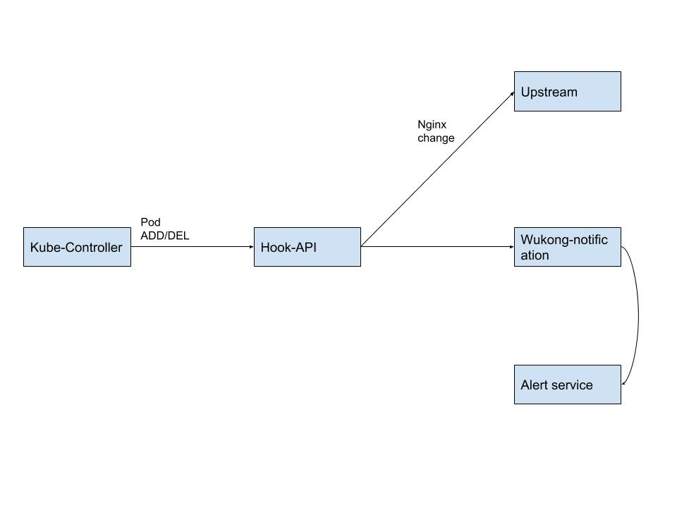

# hook-api

hook-api, working with **new kube-controller-manager** <http://issue.qianbao-inc.com/Cloud/kubernetes>, to call upstream api. 

change nginx contents automatically.

## Arch

> 1. wukong notification not implemented now.
> 1. alert service may implement by svc-d.

## Install

curl -s http://fs.qianbao-inc.com/k8s/soft/update-hook.sh | sh

> now we usually get the release tar file, later use update-hook.sh to update to new version.

